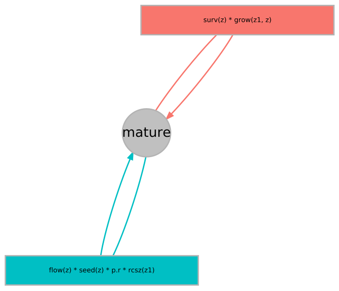

# R package: simpopmods

An R package for generating **sim**ulated **pop**ulation **mod**els (IPMs and MPMs)

:herb::mushroom::pig2::seedling::cactus::deciduous_tree::water_buffalo:

This package is under active development - enter at you own risk

## About

This is an R package I have been developing for my PhD research to simulate population models. It uses integral projection models.

## Installation

How to install this package from GitHub

```{r}
#install.packages("devtools")
library(devtools)

#install_github("simonrolph/simpopmods")
library(simpopmods)

#install.packages("rsvg")
library(DiagrammeR)

library(ggplot2)
```

## Usage

### Define an IPM

Before you generate any simulated populations, you first need to define a template for your population model. This is done through a IPM descriptor object. You can generate a template for the IPM descriptor by using the `init_IPM_desc()` function.

An `simpopmods` IPM descriptor consists of

 * Discrete states
 * Continous states (which all share the same domain)
 * Parameters
   + Name of parameter
   + maximum possible value
   + Minimum possible value
   + T/F as to whether it is sampled directly, or derived from a combination of other parameters
 * Functions for generating parameters that are not sampled directly
 * Demographic functions (equations of parameters)
 * Kernels (consisting of demographic functions)
 * Functions for the upper limit, lower limit and resolution of the kernel of the continuous state domain.
 
Here's one I made earlier:
 
```{r}
################ IPM_desc

states <- c("mature")
states_z <- c(T)

# $par_info
par_info <- data.frame(t(data.frame(
  ## survival
  surv.int  =  c(par = "surv.int",min = -10,max = 4,samp = T),
  surv.z    =   c(par = "surv.z",min = 0,max = 10,samp = T),

  ## flowering
  flow.int  = c(par = "flow.int",min = -10,max = 10,samp = T),
  flow.z    =   c(par = "flow.z",min = 0,max = 10,samp = T),

  ## growth
  grow.int  =   c(par = "grow.int",min = 0,max = 1,samp = T),
  grow.z    =   c(par = "grow.z",min = 0,max = 1,samp = F), # constrained from 0 to 1
  grow.sd   =   c(par = "grow.sd",min = 0.01,max = 0.5,samp = T),

  ## recruit size
  rcsz.int  =   c(par = "rcsz.int",min = 0,max = 0,samp = F), # doesn't change
  rcsz.sd   =   c(par = "rcsz.sd",min = 0.1,max = 0.5,samp = T),

  ## seed size
  seed.int  =   c(par = "seed.int",min = 0,max = 100,samp = T),
  seed.z    =   c(par = "seed.z",min = 0,max = 10,samp = T),

  ## recruitment probability
  p.r       =   c(par = "p.r",min = 0,max = 0.99,samp = T) # constrained from 0 to 1
)),stringsAsFactors=F)

par_info$min <- as.numeric(par_info$min)
par_info$max <- as.numeric(par_info$max)
par_info$samp <- as.logical(par_info$samp)

# $par_fns
par_fns <- list(
  rcsz.int = function(params){0},
  grow.z = function(params){1 - params["grow.int"]}
)

# $demo_fns
demo_fns <- list(
  ## G_z1z -  Growth function, given you are size z now returns the pdf of size z1 next time
  grow = function(z1, z, params){
    mu <- params["grow.int"] + params["grow.z"] * z           # mean size next year
    sig <- params["grow.sd"]                                 # sd about mean
    p.den.grow <- dnorm(z1, mean = mu, sd = sig)             # pdf that you are size z1 given you were size z
    return(p.den.grow)
  },

  ## s_z Survival function, logistic regression
  surv = function(z, params){

    linear.p <- params["surv.int"] + params["surv.z"] * z  # linear predictor
    p <- pmin(1/(1+exp(-linear.p)),rep(0.99,length(z))) # logistic transformation to probability with constant cap
    p <- 1/(1+exp(-linear.p))
    return(p)
  },

  ## p_bz Probability of flowering function, logistic regression
  flow = function(z, params){
    linear.p <- params["flow.int"] + params["flow.z"] * z      # linear predictor
    p <- 1/(1+exp(-linear.p))                                # logistic transformation to probability
    return(p)
  },

  ## b_z Seed production function
  seed = function(z, params){
    N <- exp(params["seed.int"] + params["seed.z"] * z)   # seed production of a size z plant
    return(N)
  },

  ## c_0z1 Recruit size pdf
  rcsz = function(z1, params){
    mu <- params["rcsz.int"]
    sig <- params["rcsz.sd"]
    p.deRecr <- dnorm(z1, mean = mu, sd = sig)              # pdf of a size z1 recruit
    return(p.deRecr)
  }
)

kernels <- c("P","Fec")

kernel_fns <- init_nested_list(kernels,states)
# kernel_fns$P$   TO   $   FROM

# SURVIVAL/GROWTH
kernel_fns$P$mature$mature <- function (z1, z, params) {
  return(IPM_desc$demo_fns$surv(z, params) * IPM_desc$demo_fns$grow(z1, z, params))
}

# FECUNDITY
kernel_fns$Fec$mature$mature <- function (z1, z, params) {
  #flowering * number of seeds * recruit survival * recruit size * seedbank splitter
  return( IPM_desc$demo_fns$flow(z, params) * IPM_desc$demo_fns$seed(z, params) * params["p.r"] * IPM_desc$demo_fns$rcsz(z1, params))
}

# lower size limit to prevent eviction
limit_lower <- function(params, IPM_desc){
  max_sd <- params["rcsz.sd"]+params["grow.sd"]
  # returns the lower size limit of the kernel
  # a value of 0.05 means that 5% of new recruits are evicted

  qnorm(0.01,mean = 0, sd = max_sd)
}

#upper size limit to prevent eviction
limit_upper <- function(params,IPM_desc){

  upper_lims <- seq(from = 2, to = 10, by = 1)

  #Calculate the proportion of individuals wrongly evicted at a size with a size limit
  fac1 <- IPM_desc$demo_fns$surv(upper_lims, params) # survival probability ~ z
  #integrate(function(x) IPM_desc$demo_fns$grow(x, z, params), U, Inf)$value

  inter <- function(x) {
    integrate(function(x) IPM_desc$demo_fns$grow(x, x, params), x, Inf)$value
  }

  fac2 <- sapply(upper_lims,inter)

  props <- fac1 * fac2
  props[props>0.01] <- 0
  upper_lim <- upper_lims[which.max(props)]

  return(upper_lim)
}

kernel_res <- function(params,IPM_desc,units_per_sd = 25){
  min_sd <- min(params["rcsz.sd"],params["grow.sd"])
  return(units_per_sd/min_sd)
}

# IPM_desc object
IPM_desc <- list(
  states = states,
  states_z = states_z,
  kernels = kernels,
  par_info = par_info,
  par_fns = par_fns,
  demo_fns = demo_fns,
  kernel_fns = kernel_fns,
  limit_lower = limit_lower,
  limit_upper = limit_upper,
  kernel_res = kernel_res
)
```
 
Running `plot_diagram(IPM_desc = IPM_desc)` produce a diagram produced by `DiagrammR`. Use `DiagrammeR::render_graph(IPM_diagram)` to render the diagram.

```{r}
IPM_diagram <- plot_diagram(IPM_desc = IPM_desc)
#render_graph(IPM_diagram)

#export
library(DiagrammeRsvg)
library(rsvg)
IPM_diagram %>%
  export_graph(
  file_name = "IPM_descs/IPM_desc_basic_graph.svg",
  file_type = "SVG",
  width = 700,
  height = 600)

```


 
### Create an IPM

Create a parameter set or use a sampler to sample parameter sets. I have been using an Adaptive Metropolis Algorithym with delayed rejection from the R package `FME`. This requires some informative priors.

Whenever I'm using parameter sets my convention is to refer to an incomplete parameter set (aka only the parameters that are sampled directly) as `params_ic` (as in parameters incomplete) and full parameter sets as `params_c` (as in, parameters complete).

```{r}
# a starting incomplete parameter set
params_ic <- c(
  surv.int  =  0,
  surv.z    =   2,
  flow.int  = 0.3,
  flow.z    =   0.1,
  grow.int  =   0.2,
  grow.sd   =   0.25,
  rcsz.sd   =   0.3,
  seed.int  =   2.35,
  seed.z    =   2.37,
  p.r       =   0.4
)

# create a complete parameter set
params_c <- make_full_params(params_ic = params_ic, IPM_desc = IPM_desc)
```

Once you have a parameter set you can create an IPM with:

```{r}
IPM <- make_kernels(params_c,IPM_desc)
```

This IPM can be discritised to an MPM by specifying a target stabe stage distribution for the MPM like so:

```{r}
qtiles <- c(0,0.2,0.4,0.7,1)
MPM <- make_MPM (params_c, IPM_desc, qtiles, submesh_res = 200)
```

lambda doesn't change in the discretisation process and you can use the `calc_dom_eig()` function to calculate the dominant eigenvalue from the mega kernel:

We also result with the same stabe stage distribuion as the qtiles that we specified above.

```{r, fig.height=4, fig.width=3}
plot_MIPM(IPM)
plot_MIPM(MPM)
```

```{r}
calc_dom_eig(IPM)$lambda
calc_dom_eig(MPM)$lambda

diff(qtiles)
as.numeric(calc_dom_eig(MPM)$w)
```

You can also plot the individual trajectories as IPM diagnosis with `plot_trajectories(MIPM,pop_n = 100,t_steps = 50)`

*This currently only works for IPMs, not discretised MPMs*

```{r}
plot_trajectories(IPM,pop_n = 100,t_steps = 50)
```

### Sampling parameter sets

I have been using an Adaptive Metrpolis algorithm implemented with `FME::modMCMC` with success.

First, define a function that returns -2 x log(likelihood) from an incomplete parameter set. It it also useful to define a similar prior function that also returns -2 x log(likelihood) from an incomplete parameter set.

```{r}
likelihood_function <- function(params_ic,IPM_desc){
  # create the full parameter set
  params_c <- make_full_params(params_ic = params_ic, IPM_desc = IPM_desc)
  
  # make the IPM using simpopmods
  IPM <- make_kernels(params_c,IPM_desc = IPM_desc)
  
  # calculate lambda, at a fairly high tolerence for speed
  eigens <- calc_dom_eig(IPM,tol = 0.005)
  growth_rate <- eigens$lambda
  
  # calculate log likelihood
  likelihood <- sum(dnorm(growth_rate,mean = 1, sd = 0.1))
  log_likelihood <- log(likelihood)
  
  #return
  return(-2*log_likelihood)
}

#check it correctly gives a likelihood value
likelihood_function(params_ic,IPM_desc = IPM_desc)

#Here's an example prior function for the parameters on the survival function:
IPM_prior_fn <- function(params_ic){
  params <- as.list(params_ic)
  log_likelihood <- log(dnorm(params$surv.int,mean = 1, sd = 1)) #surv int
  log_likelihood <- log_likelihood + log(dnorm(params$surv.z,mean = 2, sd = 2)) # surv.z
  return(-2*log_likelihood)
}

```

Run the sampler

```{r, fig.height=8, fig.width=8}
#load in the FME library
library(FME)

#extract the upper and lower limits from IPM desc to use as arguments for the modMCMC function
lower <- IPM_desc$par_info$min[IPM_desc$par_info$samp]
upper <- IPM_desc$par_info$max[IPM_desc$par_info$samp]

# jump is the starting step size
jump <- (upper-lower)/100

start_time <- Sys.time()
# run the sampler, use ?modMCMC for more information, the documentation is quite good.
samples <- modMCMC(f = likelihood_function, # -2*log likelihood function
                       p = params_ic, # starting parameter set
                       IPM_desc = IPM_desc,
                       niter = 200, # number of iterations
                       updatecov = 500, # how many iterations after which to update the covariance matrix
                       burninlength = 0, # how many iterations to keep updating covariance matrix
                       lower = lower, # lower bounds
                       upper = upper, # upper bounds
                       jump = jump,
                       ntrydr = 3 # number of tries (delayed rejection)
                      )

# how long did this take?
Sys.time() - start_time

#extract the parameter sets from the MCMC object and generate a full set of parameters to include those that cwere not sampled directly
param_sets_ic <- samples$pars
param_sets <- t(apply(param_sets_ic,FUN = make_full_params,1,IPM_desc=IPM_desc))

# use unique() to remove cases where the chain failed to jump to a new parameter set
param_sets <- as.data.frame(unique(param_sets))

# pariwise plot
pairs(param_sets,pch = ".")
```

Calculate lambda from the parameter sets to see that lambda is ~ 1 (or at least converging towards in this short run)

```{r}
# apply function to go throug heach parameter set, construct and IPM and calculated lambda.
param_sets$lambda <- apply(param_sets,
        FUN = function(params_c,IPM_desc){
    IPM <- simpopmods::make_kernels(params_c,IPM_desc)
    return(calc_dom_eig(IPM)$lambda)
  },
  MARGIN = 1,
  IPM_desc = IPM_desc
)

# a quick little plot
plot(param_sets$lambda)
```

That's just a taster. You need a lots of burn in and thinning to remove autocorrelation to generate anything vaguely useful.

## Tests

This R package has tests inplemented with R package `testthat`

These test to make sure that:

 * Lambda does not change during discretisation from IPM to MPM
 * Stable stage distribution of resulting MPM is the same as the target specified quantiles
 
The tests uses three different IPM descriptors.
 
## Contact

Simon Rolph - `srolph1@sheffield.ac.uk`

## Related packages

 * [popbio](https://github.com/cstubben/popbio) - popbio is an R package for modeling population growth rates using age- or stage-classified matrix models. The package consists mainly of methods described in Hal Caswell's Matrix Population Models (2001) and Morris and Doak's Quantitative Conservation Biology (2002).
 * [Rage](https://github.com/jonesor/Rage)
 * [Rcompadre](https://github.com/jonesor/Rcompadre)

## IPM book

[Data-driven Modelling of Structured Populations](http://www.springer.com/gb/book/9783319288918) :star::star::star::star::star: 


## Appendix


