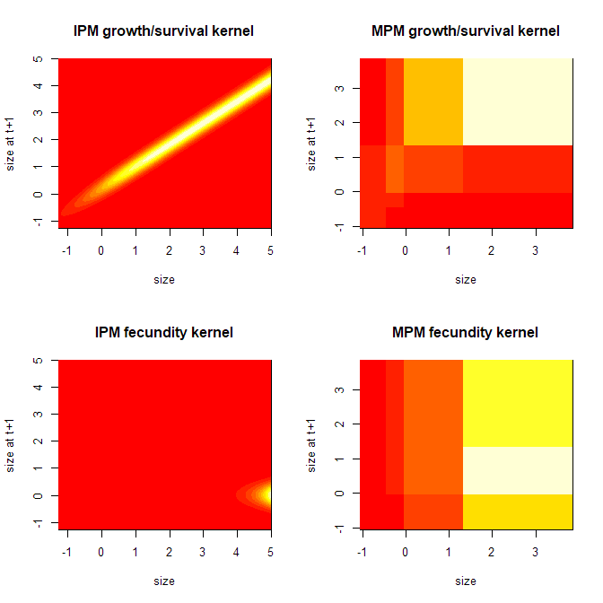

R package: simpopmods
=====================

An R package for generating *sim*ulated *pop*ulation *mod*els (IPMs and MPMs)

:herb::mushroom::pig2::seedling::cactus::deciduous\_tree::water\_buffalo:

This package is under active development - do not use

About
-----

This is an R package I have been developing for my PhD research to simulate population models. It uses integral projection model

Installation
------------

How to install this package from GitHub

``` r
install.packages("devtools")
library(devtools)
install_github("simonrolph/simpopmods")
```

Usage
-----

### Define an IPM

Before you generate any simulated populations, you first need to define a template for your population model. This is done through a IPM descriptor object. You can generate a template for the IPM descriptor by using the `init_IPM_desc()` function.

An `simpopmods` IPM descriptor consists of \* Discrete states \* Continous states (which all share the same domain) \* Parameters \* Functions for generating parameters that are not sampled directly \* Demographic functions (equations of parameters) \* Kernels (consisting of demographic functions) \* Functions for the upper limit, lower limit and resolution of the kernel of the continious state domain.

``` r
load("~/PhD/simpopmods/IPM_descs/plant_basic_IPM_desc.Rdata")
```

### Create an IPM

Create a parameter set or use a sampler to sample parameter sets. I have been using an Adaptive Metropolis Algorithym with delayed rejection from the R package `FME`. This requires some informative priors.

``` r
params <- c(
  surv.int  =  0,
  surv.z    =   2,
  flow.int  = 0.3,
  flow.z    =   0.1,
  grow.int  =   0.2,
  grow.sd   =   0.25,
  rcsz.sd   =   0.3,
  seed.int  =   2.35,
  seed.z    =   2.37,
  p.r       =   0.4
)

# create a complete parameter set
params_c <- make_full_params(params_ic = params, IPM_desc = IPM_desc)
```

Once you have a parameter set you can create an IPM and create the mega\_kernels by:

``` r
IPM <- make_kernels(params_c,IPM_desc)
```

This IPM can be discritised to an MPM by specifying a target stabe stage distribution for the MPM like so:

``` r
qtiles <- c(0,0.2,0.4,0.7,1)
MPM <- make_MPM (params_c, IPM_desc, qtiles, submesh_res = 200)
```

lambda doesn't change in the discretisation process and you can use the `calc_dom_eig()` function to calculate the dominant eigenvalue from the mega kernel:



    ## Lambda of IPM: 4.16542970923255

    ## Lambda of MPM: 4.16559953440542

This R package has tests inplemented with R package `testthat`

Related packages
----------------

-   [popbio](https://github.com/cstubben/popbio) - popbio is an R package for modeling population growth rates using age- or stage-classified matrix models. The package consists mainly of methods described in Hal Caswell's Matrix Population Models (2001) and Morris and Doak's Quantitative Conservation Biology (2002).
-   [Rage](https://github.com/jonesor/Rage)
-   [Rcompadre](https://github.com/jonesor/Rcompadre)

IPM book
--------

[Data-driven Modelling of Structured Populations](http://www.springer.com/gb/book/9783319288918) :star::star::star::star::star:
